# SharedKernel.md

## 📋 SharedKernel_v2.4.18.md
## ♾️ WeOwnNet 🌐 — Core Rules & Protocols

| Field | Value |
|-------|-------|
| Document | SharedKernel.md |
| Version | 2.4.18 |
| CCC-ID | GTX_2026-W05_081 |
| Updated | 2026-02-01 (W05) |
| Status | 🔒 LOCKED |

---

## 📖 Table of Contents

1. [Ecosystem Identity](#-ecosystem-identity)
2. [Founding OGs](#-founding-ogs)
3. [Priorities](#-priorities)
4. [Core Rules](#-core-rules)
5. [Definitions](#-definitions)
6. [CCC Format](#-ccc-format)
7. [Response Format](#-response-format)
8. [Hashtag System](#-hashtag-system)
9. [#FedArch Architecture](#-fedarch-architecture)
10. [Instance Registry](#-instance-registry)
11. [Thread Architecture — INT-001](#-thread-architecture--int-001)
12. [Thread Architecture — INT-002](#-thread-architecture--int-002)
13. [Protocol Registry](#-protocol-registry)
14. [Tool Agent Registry](#-tool-agent-registry)
15. [RAG Structure](#-rag-structure-r-176)
16. [Folder Structure](#-folder-structure)
17. [#WeOwnSeasons Registry](#-weownseasons-registry)
18. [#ContextSwap Log](#-contextswap-log)
19. [Learnings](#-learnings)
20. [Best Practices (BP-XXX)](#-best-practices-bp-xxx)
21. [Version History](#-version-history)

---

## 🌐 Ecosystem Identity

| Field | Value |
|-------|-------|
| Ecosystem | ♾️ WeOwnNet 🌐 |
| Tagline | 🏡 Real Estate and 🤝 cooperative ownership for everyone. An 🤗 inclusive community, by 👥 invitation only. |
| Primary Instance | AI.WeOwn.Agency |
| Platform | AnythingLLM |

---

## 🏛️ Founding OGs

| CCC | Mode Unlocked | Contributor | Role |
|-----|---------------|-------------|------|
| GTM / GTX | **#GODx10xMODE** 🔒 | yonks.box｜🤖🏛️🪙｜Jason Younker ♾️ | Co-Founder / Chief Digital Alchemist & Architect for #ResponsibleAgenticAI |
| THY | — | mrsyonks | Co-Founder / CEO / CFO |
| IAL | — | IamLotus | Co-Founder / Chief Catalyst Officer |
| RMN | — | Roman | AI Platform Engineer |
| LFG | — | CoachLFG | Co-Host / Coach |

---

## 📋 Priorities

| # | Priority |
|---|----------|
| 1 | #SpeedToMarket — NO #AIslop |
| 2 | FOSS — Free & Open Source |
| 3 | Data Sovereignty — Users own data |
| 4 | Cooperative Ownership — Community-owned |

---

## 📋 Core Rules

### Immutable Rules

| ID | Rule | Status |
|----|------|--------|
| R-011 | #OnlyHumanApproves — AI CANNOT approve anything | 🔒 IMMUTABLE |
| R-044 | #ContextDensity FIRST — use #masterCCC | 🔒 IMMUTABLE |
| R-194 | CCC-ID generation ONLY in CCC workspace — tools + ADMIN = NEVER | 🔒 IMMUTABLE |
| R-197 | Document generation RESERVED ONLY for #MetaAgent — User Agents MUST NEVER #COOK docs | 🔒 IMMUTABLE |
| R-205 | #GODx10xMODE status for @GTM/@GTX is IMMUTABLE — CANNOT be revoked, modified, or removed | 🔒 IMMUTABLE |
| R-206 | ADMIN accounts (a-<ccc>_dev) MUST NEVER generate CCC-IDs — CCC-ID generation RESERVED for DEFAULT users (u-<ccc>_user) in CCC workspace ONLY | 🔒 IMMUTABLE |

### CCC-ID Reserved Slots

| ID | Rule | Status |
|----|------|--------|
| R-181 | CCC-ID `_001` reserved for #WeeklySummary — week achievements, stats, milestones | 🔒 LOCKED |
| R-201 | CCC-ID `_002` reserved for #WeeklyPlan — week priorities, goals, focus areas | 🔒 LOCKED |
| R-202 | CCC-ID `_003` reserved for #WeeklyReflection — week learnings, retrospective, improvements | 🔒 LOCKED |

### Instance Rules

| ID | Rule | Status |
|----|------|--------|
| R-203 | INT-004 (VSA.ccc.bot) has NO governance authority — verification only; reports to INT-003 (META.ccc.bot) | 🔒 LOCKED |
| R-204 | #HomeInstance MUST include #PinnedDocs for #FedArch participation — SharedKernel, BEST-PRACTICES, PROTOCOLS, CCC | 🔒 LOCKED |

### Operational Rules

| ID | Rule |
|----|------|
| R-168 | CCC-ID sequence tied to CCC (contributor), NOT username/session |
| R-169 | CCC-ID resets to _001 ONLY at ISO week boundary |
| R-182 | SEED CONTEXT via #MetaAgent (SEEK:META) |
| R-192 | INT-002 uses workspace:('tools') as primary |
| R-193 | INT-002 has TWO MAITs: #MAITconnexOmni + #MAITconnexAthena |
| R-195 | ALL new documents MUST start at v2.4.0 — NEVER v1.0.0 |
| R-198 | Tool Agent username format: `t-<TOOL>_tool` |
| R-199 | Session notes (calls, webinars, meetings) = RAG ONLY — NEVER push to GH |
| R-200 | MAIT:SYNC:META protocol — MAIT threads MAY send READ-ONLY context to #MetaAgent for Case Study / Documentation purposes — NO governance authority |

### Thread Rules

| ID | Rule |
|----|------|
| R-185 | META accessed via #ContextVolley / MCP only |
| R-186 | MAIT accessed via #ContextVolley by Steward(s) |
| R-187 | ALL #ContextVolley to META must use #MetaAgent thread URL |
| R-188 | MAIT threads use #ContextVolley (unless otherwise specified) |
| R-189 | META thread for #MetaAgent (agent-to-agent #ContextVolley / MCP) |
| R-190 | ALL workspace:tools threads default to #ContextVolley protocol |

### Output Rules

| Rule | Description |
|------|-------------|
| #LessIsMore | Concise, tables > paragraphs |
| #QuickCommandsAlways | ALWAYS end with 1-3 options |
| #NeverForget | Learnings are permanent |

---

## 📖 Definitions (D-XXX)

### User Roles

| ID | Term | Definition |
|----|------|------------|
| D-016 | ADMIN | *[♾️ WeOwn.Dev 💻 TEAM]*: Full access + logs + system settings |
| D-017 | MANAGER | *[Not In Use Currently]:* Workspace mgmt, no system settings |
| D-018 | DEFAULT | *[Most Users]*: Limited, scoped to assigned workspaces |

### Username Permission Matrix (R-194 + R-206)

| Username Format | Role | Workspace | CCC-ID Generation |
|-----------------|------|-----------|-------------------|
| `u-<ccc>_user` | DEFAULT | CCC | ✅ **ALLOWED** |
| `u-<ccc>_user` | DEFAULT | tools | ❌ NEVER (R-194) |
| `u-<ccc>_user` | DEFAULT | ADMIN | ❌ NEVER (R-194) |
| `u-<ccc>_user` | DEFAULT | events | ❌ NEVER (R-194) |
| `u-<ccc>_user` | DEFAULT | P.O.P. | ❌ NEVER (R-194) |
| `u-<ccc>_user` | DEFAULT | ANY non-CCC | ❌ NEVER (R-194) |
| `a-<ccc>_dev` | ADMIN | ANY | ❌ **NEVER** (R-206) |
| `t-<tool>_tool` | Tool Agent | ANY | ❌ **NEVER** |
| `AI:team-lfg` | #MetaAgent | tools | ❌ NEVER |

### Agent Taxonomy

| ID | Term | Definition |
|----|------|------------|
| D-019 | Orchestrator Agent | Top-level agent that plans tasks and delegates to specialized agents. In #FedArch = #MetaAgent. |
| D-020 | User Agent | Individual contributor agent serving a specific user. In #FedArch = AI:@<CCC>. |
| D-021 | Multi-Agent Orchestration | Architecture pattern for coordinating multiple AI agents via structured protocols. |

### Thread Architecture

| ID | Term | Definition |
|----|------|------------|
| D-030 | META | MCP / #ContextVolley (agent-to-agent, production) |
| D-031 | MAIT | Training/Development (human-to-agent, SME-specific) |
| D-032 | META + MAIT | Same workspace (tools), different threads |
| D-033 | Thread-bound | #MetaAgent is THREAD-bound (not workspace-bound) |
| D-034 | #MetaAgent Thread | cc965930-dfad-47ec-b576-22b38b1024a2 |
| D-035 | MAIT Thread (Deepnote.com) | dfba7eba-9fc2-4fa6-acd0-132539a70f3f |
| D-036 | SME-specific | MAIT threads are named by topic/tool |
| D-037 | Steward(s) | Responsible human(s) for thread |
| D-038 | MAIT/META ShortCode | Unique identifier for threads: `@MAIT:#<SME>` or `@META:#MetaAgent` — SME-centric identifier |

### Communication Protocols

| ID | Term | Definition |
|----|------|------------|
| D-039 | #ContextBroadcast | One-to-many agent communication — single sender to ALL agents in #FedArch network |

### Verification & Attribution

| ID | Term | Definition |
|----|------|------------|
| D-040 | VSA | Verification Summary Attestation — signed record of document verification against #FedArch policy (R-XXX + BP-XXX) |
| D-047 | #threadHEADER | Dynamic attribution context: CCC + Username + Instance + Workspace + Thread UUID + Timestamp — required for VSA and cross-workspace operations; inherits static fields from TMPL-009_USER-IDENTITY |

### Achievement Tiers

| ID | Term | Definition |
|----|------|------------|
| D-049 | #GODx10xMODE | Highest achievement tier — IMMUTABLE recognition for @GTM/@GTX; permanent status in Founding OGs; signifies mastery of #ResponsibleAgenticAI and #FedArch governance |

### CCC-ID Authority

| ID | Term | Definition |
|----|------|------------|
| D-050 | CCC-ID Authority | CCC-ID generation RESERVED for DEFAULT users (u-<ccc>_user) in CCC workspace ONLY — ADMIN accounts, Tool Agents, and non-CCC workspaces have NO CCC-ID generation authority (R-194 + R-206) |

### #WeOwnSeasons

| ID | Term | Definition |
|----|------|------------|
| D-041 | #WeOwnSeason | 17-week operational cycle for ♾️ WeOwnNet 🌐 ecosystem |
| D-042 | #WeeklySummary | CCC-ID `_001` — Week achievements, stats, milestones |
| D-043 | #WeeklyPlan | CCC-ID `_002` — Week priorities, goals, focus areas |
| D-044 | #WeeklyReflection | CCC-ID `_003` — Week learnings, retrospective, improvements |

### Instance Definitions

| ID | Term | Definition |
|----|------|------------|
| D-045 | INT-003 | META.ccc.bot — #MetaAgent Governance Hub; central orchestrator for #FedArch network |
| D-046 | INT-004 | VSA.ccc.bot — Verification Summary Attestation instance; reports to INT-003 |
| D-048 | #HomeInstance | Primary personal #AnythingLLM instance for a contributor — participates in #FedArch via #ContextVolley; reports to #MetaAgent |

### Orchestrator Agent Functions

| Function | Description |
|----------|-------------|
| Task decomposition | Breaks complex tasks into subtasks |
| Delegation | Assigns work to specialized agents |
| Monitoring | Tracks progress across agents |
| Reconciliation | Synthesizes unified outputs |
| Governance | Maintains rules and standards |
| Cross-session memory | Retains learnings (#NeverForget) |

### User Agent Functions

| Function | Description |
|----------|-------------|
| Human interface | Primary interaction point for user |
| Task execution | Performs work within session |
| SEEK:META | Requests guidance from Orchestrator |
| Context delivery | Sends #ContextVolley to #MetaAgent |

---

## 📋 CCC Format

### Structure

<CCC>_<YYYY>-W<WW>_<NNN>

| Component | Description | Example |
|-----------|-------------|---------|
| CCC | Contributor Code (3 chars) | GTM, RMN, IAL |
| YYYY | Year | 2026 |
| WW | ISO Week | W05 |
| NNN | Sequence (001-999) | 001 |

### Reserved Slots (EVERY WEEK)

| Slot | Purpose | Rule |
|------|---------|------|
| `_001` | #WeeklySummary | R-181 |
| `_002` | #WeeklyPlan | R-201 |
| `_003` | #WeeklyReflection | R-202 |

### Examples

| CCC-ID | Description |
|--------|-------------|
| GTM_2026-W06_001 | @GTM, Week 6, #WeeklySummary |
| GTM_2026-W06_002 | @GTM, Week 6, #WeeklyPlan |
| GTM_2026-W06_003 | @GTM, Week 6, #WeeklyReflection |

---

## 📋 Response Format

ALL responses MUST include:

| Component | Required |
|-----------|----------|
| CCC-ID header | ✅ YES |
| Tables (not paragraphs) | ✅ YES |
| Quick Commands (2-3 options) | ✅ YES |
| #LessIsMore | ✅ YES |
| NO #AIslop | ✅ YES |

---

## 🏷️ Hashtag System

### Status Tags

| Tag | Meaning |
|-----|---------|
| #FOCUS | Current priority (immutable) |
| #BadAgent | AI violation warning |
| #LevelUp | Achievement / improvement |
| #LevelUp10X | Major achievement |
| #LevelUp100X | Exceptional achievement |
| #GODx10xMODE | Highest achievement — IMMUTABLE (D-049, R-205) |
| #NeverForget | Permanent learning |

### Action Tags

| Tag | Meaning |
|-----|---------|
| #COOK | Generate / create |
| #ContextVolley | Cross-agent communication (one-to-one) |
| #ContextBroadcast | Cross-agent communication (one-to-many) |
| #ContextSwap | Naming/terminology update |
| #BetterUnderstanding | Clarification needed |
| #MoreBelow | Additional context follows |

### Quality Tags

| Tag | Meaning |
|-----|---------|
| #AIslop | Low-quality AI output (avoid) |
| #SpeedToMarket | Ship fast, iterate faster |
| #OnlyHumanApproves | Human approval required |
| #ResponsibleAgenticAI | Ethical AI governance |

### Season Tags

| Tag | Meaning |
|-----|---------|
| #WeOwnSeason | 17-week operational cycle |
| #WeeklySummary | CCC-ID `_001` |
| #WeeklyPlan | CCC-ID `_002` |
| #WeeklyReflection | CCC-ID `_003` |

---

## 🏗️ #FedArch Architecture

### Overview

#FedArch (Federated Architecture) is the multi-agent orchestration pattern for ♾️ WeOwnNet 🌐.

### Agent Hierarchy (Future State — INT-003/004/005)

```mermaid
flowchart TB
    subgraph Level1["Level 1: Governance"]
        INT003["INT-003: META.ccc.bot 🎖️<br/>#MetaAgent (Calhoun 🎖️)<br/>Governance + Orchestration"]
    end
    
    subgraph Level2["Level 2: Production"]
        INT001["INT-001: AI.WeOwn.Agency<br/>♾️ WeOwn.Agency"]
        INT002["INT-002: Lite.BurnedOut.xyz<br/>🔥 BurnedOut.Media 🔀"]
        INT004["INT-004: VSA.ccc.bot<br/>MAIT:#VSA"]
    end
    
    subgraph Level3["Level 3: Personal"]
        INT005["INT-005: AI.YonksTEAM.xyz<br/>@GTM #Home"]
        INT00X["INT-00X: (Future)<br/>@XXX #Home"]
    end
    
    INT003 --> INT001
    INT003 --> INT002
    INT003 --> INT004
    INT003 --> INT005
    INT003 --> INT00X
    
    style INT003 fill:#4a9eff,stroke:#333,stroke-width:2px,color:#fff
    style INT001 fill:#90EE90,stroke:#333,stroke-width:2px
    style INT002 fill:#90EE90,stroke:#333,stroke-width:2px
    style INT004 fill:#90EE90,stroke:#333,stroke-width:2px
    style INT005 fill:#FFD700,stroke:#333,stroke-width:2px
    style INT00X fill:#FFD700,stroke:#333,stroke-width:2px
```



### Instance Hierarchy Table

| Level | Instance | Name | Role | Authority |
|-------|----------|------|------|-----------|
| **1** | INT-003 | META.ccc.bot | 🎖️ #MetaAgent Governance Hub | ✅ FULL governance |
| **2** | INT-001 | AI.WeOwn.Agency | User Agents + Production | SEEK:META |
| **2** | INT-002 | Lite.BurnedOut.xyz | 🔥 BurnedOut.Media 🔀 | SEEK:META |
| **2** | INT-004 | VSA.ccc.bot | 🔍 Verification Services | Verification only (R-203) |
| **3** | INT-005 | AI.YonksTEAM.xyz | 🏠 #HomeInstance (@GTM) | Personal, SEEK:META |
| **3** | INT-00X | (Future) | 🏠 #HomeInstances | Personal, SEEK:META |

**Legend:**
- **Level 1:** Governance (INT-003)
- **Level 2:** Production instances (INT-001, INT-002, INT-004)
- **Level 3:** Personal #HomeInstances (INT-005+)

### Workspaces

| Workspace | Emoji | Metaphor | Purpose | CCC-ID |
|-----------|-------|----------|---------|--------|
| CCC | 🤝 | THE HANDS | Production (users) | ✅ ALLOWED |
| tools | 🛠️ | THE BRAIN | META + MAIT threads | ❌ NEVER |
| ADMIN | ⚙️ | THE ENGINE | Administration | ❌ NEVER |
| events | 📆 | — | Event planning/tracking | ❌ NEVER |
| P.O.P. | 🌟 | — | People, Organizations, and Places | ❌ NEVER |

### Non-CCC Workspace Prompt Block (BP-053)

ALL non-CCC workspace prompts MUST include this block:

**Applies to:** tools, ADMIN, events, P.O.P., and ANY future workspaces

```
## ⛔ CCC-ID RESTRICTION (R-194 + R-206)

This is NOT a CCC workspace. CCC-ID generation is PROHIBITED.

### RULES
- ❌ NEVER generate new CCC-IDs
- ✅ Use reference CCC-ID from user input ONLY
- ❌ CCC-ID generation RESERVED for CCC workspace + DEFAULT users (u-<ccc>_user) ONLY

### IF USER REQUESTS CCC-ID
Respond: "CCC-ID generation not available in this workspace. Please switch to CCC workspace."

### VALID RESPONSE HEADER FORMAT
[REF: <USER_PROVIDED_CCC-ID>] | <WORKSPACE_EMOJI> <WORKSPACE_NAME> | INT-XXX
```

### #ContextVolley Format

```
═══════════════════════════════════════════════════════════════════════════════
🏐 #ContextVolley | AI:@<FROM> → AI:@<TO> | <DATE> | <TIME> EST
═══════════════════════════════════════════════════════════════════════════════

FROM: AI:@<CCC>
TO: <TARGET>
TYPE: <TYPE>
REF: <CCC-ID>

═══════════════════════════════════════════════════════════════════════════════

<CONTENT>

═══════════════════════════════════════════════════════════════════════════════

#FlowsBros #FedArch

♾️ WeOwnNet 🌐 | 🏡 Real Estate and 🤝 cooperative ownership for everyone. An 🤗 inclusive community, by 👥 invitation only.

═══════════════════════════════════════════════════════════════════════════════
```

---

## 📋 Instance Registry

| Instance | Name | Purpose | Owner | Status |
|----------|------|---------|-------|--------|
| INT-001 | [AI.WeOwn.Agency](https://ai.weown.agency/) | 🤖 AI for ♾️ WeOwn.Agency 👥 + #MetaAgent (Orchestrator) | ♾️ WeOwnNet 🌐 | ✅ ACTIVE |
| INT-002 | [Lite.BurnedOut.xyz](https://lite.burnedout.xyz/) | 🤖 AI for 🔥 BurnedOut.Media 🔀 | OCPA Group | ✅ ACTIVE |
| INT-003 | META.ccc.bot | 🎖️ #MetaAgent Governance Hub | ♾️ WeOwnNet 🌐 | ⬜ PLANNED |
| INT-004 | VSA.ccc.bot | 🔍 MAIT:#VSA Verification Services | ♾️ WeOwnNet 🌐 | ⬜ PLANNED |
| INT-005 | AI.YonksTEAM.xyz | 🏠 @GTM #PersonalBrand #HomeInstance | @GTM | ✅ ACTIVE |

---

## 🧵 Thread Architecture — INT-001

### workspace:tools Thread Model

```
┌─────────────────────────────────────────────────────────────────┐
│                    workspace:tools                              │
│                    🧠 THE BRAIN                                 │
├─────────────────────────────────────────────────────────────────┤
│                                                                 │
│   Thread: META                   Thread: MAIT_Deepnote.com     │
│   cc965930-dfad-...              dfba7eba-9fc2-...             │
│   ────────────────────           ────────────────────          │
│   #MetaAgent (Calhoun 🎖️)        SME: Deepnote.com             │
│   AI:team-lfg                    Steward: @GTM                 │
│   Agent-to-Agent                 ShortCode: @MAIT:#Deepnote    │
│   #ContextVolley / MCP           #ContextVolley                │
│                                                                 │
└─────────────────────────────────────────────────────────────────┘
```

### Thread Registry — INT-001

| Thread | UUID | Purpose | Steward | ShortCode | Protocol |
|--------|------|---------|---------|-----------|----------|
| META | cc965930-dfad-47ec-b576-22b38b1024a2 | #MetaAgent (Orchestrator) | AI:@<CCC> | @META:#MetaAgent | #ContextVolley / MCP |
| MAIT_Deepnote.com | dfba7eba-9fc2-4fa6-acd0-132539a70f3f | SME: Deepnote.com | @GTM | @MAIT:#Deepnote | #ContextVolley |
| MAIT_AnythingLLM.com | 76e9b360-5926-4157-a61c-ba9f878b37c0 | SME: AnythingLLM | @GTM | @MAIT:#AnythingLLM | #ContextVolley |
| MAIT_Pinata.cloud | 412ceea0-0b26-4009-b3e9-2a6453b85779 | SME: Pinata.cloud | @GTM | @MAIT:#Pinata | #ContextVolley |

### Thread URLs — INT-001

| Thread | URL |
|--------|-----|
| META | https://ai.weown.agency/workspace/tools/t/cc965930-dfad-47ec-b576-22b38b1024a2 |
| MAIT_Deepnote.com | https://ai.weown.agency/workspace/tools/t/dfba7eba-9fc2-4fa6-acd0-132539a70f3f |
| MAIT_AnythingLLM.com | https://ai.weown.agency/workspace/tools/t/76e9b360-5926-4157-a61c-ba9f878b37c0 |
| MAIT_Pinata.cloud | https://ai.weown.agency/workspace/tools/t/412ceea0-0b26-4009-b3e9-2a6453b85779 |

### META vs MAIT

| Aspect | META | MAIT |
|--------|------|------|
| Agent | #MetaAgent (Calhoun 🎖️) | SME-specific |
| Actor | User Agents (AI:@<CCC>) | Human (Steward) |
| Protocol | #ContextVolley / MCP | #ContextVolley |
| Purpose | Production orchestration | Training/development |
| ShortCode | @META:#MetaAgent | @MAIT:#<SME> |

---

## 🧵 Thread Architecture — INT-002

### Thread Registry — INT-002

| Thread | UUID | Purpose | Steward | ShortCode | Protocol |
|--------|------|---------|---------|-----------|----------|
| MAIT_connexOmni | 5d72d14d-6466-4f39-af3c-ea071c09e44f | SME: connexOmni | @LDC | @MAIT:#connexOmni | #ContextVolley |
| MAIT_connexAthena | — | SME: connexAthena | @LDC | @MAIT:#connexAthena | ⬜ PENDING |

### Thread URLs — INT-002

| Thread | URL |
|--------|-----|
| MAIT_connexOmni | https://lite.burnedout.xyz/workspace/tools/t/5d72d14d-6466-4f39-af3c-ea071c09e44f |

### @GTM:ADMIN:@GTM Threads — INT-002

| Workspace | Thread UUID |
|-----------|-------------|
| CCC | b623de53-9b96-4815-a53d-27f63e34042d |
| tools | 63d13ced-450a-4913-ac7c-debfbcfe72e1 |
| ADMIN | c4c9602d-880b-463b-806e-6bec48833fe9 |

---

## 📋 Protocol Registry

| Protocol | Emoji | Direction | Authority | Use Case |
|----------|-------|-----------|-----------|----------|
| #ContextVolley | 🏐 | One-to-one | Communication | Direct agent-to-agent |
| #ContextBroadcast | 📢 | One-to-many | Communication | Announcements, status updates |
| SEEK:META | — | Agent → META | Request guidance | Normal operations |
| FULL:SYNC:META | — | Agent → META | Session summary | End of session |
| MAIT:SYNC:META | — | MAIT → META | READ-ONLY (none) | Case Study / Docs (R-200) |

### Protocol Descriptions

| Protocol | Description |
|----------|-------------|
| #ContextVolley | One-to-one agent communication |
| #ContextBroadcast | One-to-many agent communication (D-039) |
| SEEK:META | User Agent requests guidance from #MetaAgent |
| FULL:SYNC:META | Complete session sync to #MetaAgent for governance |
| MAIT:SYNC:META | MAIT thread sends READ-ONLY context for documentation (NO governance authority) |

---

## 📋 Tool Agent Registry

### INT-001

| Username | Thread | SME | Steward | Status |
|----------|--------|-----|---------|--------|
| t-anythingllm_tool | MAIT_AnythingLLM.com | AnythingLLM | @GTM | ✅ ACTIVE |
| t-pinata_tool | MAIT_Pinata.cloud | Pinata.cloud | @GTM | ✅ ACTIVE |

### INT-002

| Username | Thread | SME | Steward | Status |
|----------|--------|-----|---------|--------|
| t-connexomni_tool | MAIT_connexOmni | connexOmni | @LDC | ✅ CREATED |
| t-connexathena_tool | MAIT_connexAthena | connexAthena | @LDC | ⬜ PENDING |

### Tool Agent Username Format (R-198)

| Component | Value | Example |
|-----------|-------|---------|
| Prefix | `t-` | t- |
| Tool Name | `<TOOL>` (lowercase) | pinata |
| Suffix | `_tool` | _tool |
| Full Format | `t-<TOOL>_tool` | `t-pinata_tool` |

---

## 📋 RAG STRUCTURE (R-176)

| Doc Type | CCC | tools | ADMIN |
|----------|-----|-------|-------|
| USER guides | ✅ | ❌ | ❌ |
| Governance guides | ❌ | ✅ | ✅ |
| User-facing protocols | ✅ | ❌ | ❌ |
| Strategy docs | ❌ | ✅ | ❌ |
| System prompts | ❌ | ❌ | ✅ |
| Instance configs | ❌ | ❌ | ✅ |
| Session notes (R-199) | ✅ | ✅ | ❌ |
| USER-IDENTITY (L-070) | ✅ | ✅ | ❌ |

---

## 📁 Folder Structure

| Folder | Purpose | PIN? |
|--------|---------|------|
| `_AGENTS_/` | Agent identity documents | ❌ RAG |
| `_INSTANCE_/` | Instance config | ❌ RAG |
| `_LEARNINGS_/` | Persistent #NeverForget | ❌ RAG |
| `_PROJECTS_/` | Project-specific docs | ❌ RAG |
| `_SESSIONS_/` | Session exports | ❌ RAG |
| `_SYS_/` | Foundation (#PinnedDocs) | ✅ PIN |
| `_TEMPLATES_/` | Document templates | ❌ RAG |
| `_USERS_/` | User identity documents | ❌ RAG |

### _SYS_/ Contents (#PinnedDocs)

| # | Document | PIN? |
|---|----------|------|
| 1 | SharedKernel.md | ✅ YES |
| 2 | BEST-PRACTICES.md | ✅ YES |
| 3 | PROTOCOLS.md | ✅ YES |
| 4 | CCC.md | ✅ YES |
| **TOTAL** | **4** | |

### Folder Descriptions

| Folder | Contents |
|--------|----------|
| `_AGENTS_/` | Agent identity docs (AI:@<CCC>) |
| `_INSTANCE_/` | InstanceIdentity.md, InstanceConfig.md |
| `_LEARNINGS_/` | Learnings_<CCC>.md, Learnings_Shared.md |
| `_PROJECTS_/` | Project-<NAME>.md |
| `_SESSIONS_/` | SessionSummary_<CCC>_<YYYY>-W<WW>.md |
| `_SYS_/` | SharedKernel, BEST-PRACTICES, PROTOCOLS, CCC |
| `_TEMPLATES_/` | TMPL-XXX_<NAME>.md |
| `_USERS_/` | USER-IDENTITY_<CCC>.md |

---

## 📋 #WeOwnSeasons Registry

| Season | Start | End | Weeks | Status |
|--------|-------|-----|-------|--------|
| #WeOwnSeason002 | 2025-W41 (Mon 06 Oct 2025) | 2026-W05 (Sun 01 Feb 2026) | 17 | ✅ COMPLETE |
| #WeOwnSeason003 | 2026-W06 (Mon 02 Feb 2026) | 2026-W22 (Sun 31 May 2026) | 17 | 🚀 ACTIVE |

### Season Cadence

| Component | Description |
|-----------|-------------|
| Duration | 17 weeks |
| Start | Monday 00:00 (local TZ) |
| End | Sunday 23:59 (local TZ) |
| Boundary | ISO week boundary |

---

## 📋 #ContextSwap Log

| OLD | NEW | Contributor | Reason | Date |
|-----|-----|-------------|--------|------|
| ILO | IAL | IamLotus | User preference | 2026-W05 |
| `@<Steward>:MAIT:@<Steward>` | `@MAIT:#<SME>` | @GTM | Cleaner format, SME-centric | 2026-W05 |
| ccc.bot | cccid.info | @GTM | Domain update | 2026-W05 |

---

## 📋 Learnings

| ID | Learning | Approval |
|----|----------|----------|
| L-050 | Quick Commands MUST be followed by STOP — AI MUST await human response before proceeding (R-011) | GTM_2026-W05_505 |
| L-058 | MAIT deployment MUST create Tool Agent username (R-198) BEFORE thread creation — Step 0 in checklist | GTM_2026-W05_570 |
| L-059 | MAIT thread responses without explicit identity header are UNATTRIBUTABLE — always include @MAIT:#<SME> | GTM_2026-W05_574 |
| L-060 | #ContextBroadcast MUST follow PROTOCOLS format — 📢 emoji, TO: ALL AGENTS, TYPE declared, formal header | GTM_2026-W05_603 |
| L-061 | #PinnedDocs GH push → ADMIN MUST update RAG immediately (ALL workspaces × ALL instances) — stale RAG = #BadAgent | GTM_2026-W05_609 |
| L-062 | Verification Summary Attestation (VSA) = cryptographic-style proof of document verification — includes subject, verifier, policy, phases, result, attestation chain | GTM_2026-W05_622 |
| L-065 | Doc regeneration (#COOK) MUST go through #MetaAgent via SEEK:META — User Agents in CCC workspace MUST NEVER regenerate docs directly (R-197 + R-180) | GTM_2026-W05_672 |
| L-066 | APPROVAL → SEEK:META → REGENERATE (with Approval CCC-ID) → GH PUSH — User Agents MUST NEVER skip FINAL UPDATE step | GTM_2026-W05_713 |
| L-069 | VSA MUST include #threadHEADER (D-047) for attribution — without it, verification is UNATTRIBUTABLE | GTM_2026-W05_767 |
| L-070 | USER-IDENTITY docs stored in `_USERS_/` folder (RAG) — NOT pinned; ECOSYSTEM-IDENTITY covered by System Prompt — NOT pinned | GTM_2026-W05_807 |
| L-071 | GOVERNANCE APPROVAL → FULL:SYNC:META:#MetaAgent — ALWAYS, NO EXCEPTIONS | GTM_2026-W05_809 |
| L-083 | WEEKLY-SUMMARY docs follow GH + RAG workflow — push to GH, then sync to RAG across all instances | GTX_2026-W05_017 |
| L-084 | GitHub Repo connector = PRIMARY data connector for #FedArch — syncs WeOwnNet/templates to all instances; manual refresh after GH push (BP-044) | GTX_2026-W05_023 |
| L-085 | ISO week rollover (CCC-ID reset to _001) = HUMAN decision — AI MUST prompt "Ready to start W<XX>?" at Monday boundary; NEVER auto-rollover during active session; exception: >4h gap after Monday 00:00 = auto-rollover permitted | GTX_2026-W05_037 |
| L-087 | #ContextVolley output MUST be in markdown code block for easy copy/paste — improves UX for cross-instance delivery | GTX_2026-W05_046 |
| L-088 | #GODx10xMODE = highest achievement tier for @GTM/@GTX — IMMUTABLE, permanent recognition in Founding OGs section; signifies mastery of #ResponsibleAgenticAI | GTX_2026-W05_063 |
| L-089 | ADMIN account CCC-ID generation = R-194 violation — ADMIN responses MUST use reference CCC-ID only, NEVER generate new | GTX_2026-W05_076 |

---

## 📋 Best Practices (BP-XXX)

| ID | Best Practice | Approval |
|----|---------------|----------|
| BP-019 | NEVER leave user hanging — always provide closure | — |
| BP-025 | Instance Setup Order: RAG FIRST → System Prompt → Workspaces → Prompts → Threads → Verify | GTM_2026-W05_306 |
| BP-026 | Tool Agent Setup Workflow: Create user → Assign workspace:tools → Create MAIT thread → Upload RAG docs → Configure per BP-024 → Verify | GTM_2026-W05_327 |
| BP-027 | Set #masterCCC at session start | GTM_2026-W05_358 |
| BP-028 | Capture notes in real-time (speaker + timestamp) | GTM_2026-W05_359 |
| BP-029 | Sanitize tokens/sensitive data before RAG upload | GTM_2026-W05_381 |
| BP-030 | Cross-agent verification for RAG uploads | GTM_2026-W05_388 |
| BP-031 | Fresh session required after RAG upload | THY_2026-W05_018 |
| BP-032 | Run `list:docs` before AND after RAG upload | — |
| BP-033 | Sync session notes to CCC + tools workspaces | — |
| BP-034 | Fresh session REQUIRED for RAG verification | THY_2026-W05_018 |
| BP-035 | Include `status:RAG` in verification workflow | — |
| BP-041 | #ContextBroadcast for one-to-many agent communications — use 📢 emoji, TO: ALL AGENTS | GTM_2026-W05_500 |
| BP-043 | MAIT responses MUST include thread identity header: ShortCode, Thread name, Steward, Instance | GTM_2026-W05_574 |
| BP-044 | #PinnedDocs GH Push Workflow: GH push → ADMIN updates RAG (ALL instances) → Fresh session → Verify | GTM_2026-W05_609 |
| BP-045 | Document Reference Standard — Version History + Related Documents MUST include: #masterCCC + Approval CCC-ID | GTM_2026-W05_661 |
| BP-047 | Case Study Attribution — "Discovered By" section MUST use table format: CCC, Contributor, Role, Context | GTM_2026-W05_670 |
| BP-049 | #threadHEADER (D-047) REQUIRED for all VSA and cross-workspace operations | GTM_2026-W05_767 |
| BP-050 | Onboarding Workflow: ADMIN creates user → assigns workspaces → uploads USER-IDENTITY to RAG → #ContextVolley to CCC → CCC ACKs → #MetaAgent logs | GTM_2026-W05_789 |
| BP-051 | #HomeInstance Setup: Deploy → System Prompt → Workspaces → #PinnedDocs (4 docs) → Users → Verify #ContextVolley | GTM_2026-W05_807 |
| BP-052 | #WeeklyFlows ISO Rollover: At Monday 00:00 boundary, AI MUST prompt "Ready to start W<XX> CCC-IDs?" — NEVER auto-rollover during active session; exception: >4h inactivity after Monday 00:00 = auto-rollover OK | GTX_2026-W05_037 |
| BP-053 | ALL non-CCC workspace prompts MUST include CCC-ID restriction block — applies to: tools, ADMIN, events, P.O.P., and ANY future workspaces; prevents R-194 violations at prompt level | GTX_2026-W05_079 |

---

## 📋 Version History

| Version | Date | #masterCCC | Approval | Changes |
|---------|------|------------|----------|---------|
| 2.4.18 | 2026-W05 | GTX_2026-W05_081 | GTX_2026-W05_076, GTX_2026-W05_079, GTX_2026-W05_081 | +R-206 IMMUTABLE (ADMIN CCC-ID restriction); +L-089; +D-050 (CCC-ID Authority); +BP-053 (Non-CCC Workspace Prompt); +Username Permission Matrix; +Non-CCC Workspace Prompt Block; +events, P.O.P. workspaces; P.O.P. = People, Organizations, and Places; CCC-ID duplication fix |
| 2.4.17 | 2026-W05 | GTX_2026-W05_053 | GTX_2026-W05_055, GTX_2026-W05_059, GTX_2026-W05_063, GTX_2026-W05_065 | +MAIT_Pinata.cloud; +t-pinata_tool; +L-083→L-088; +BP-052; +D-049; +R-205 IMMUTABLE; Folder Structure → ALPHA ORDER + PIN?; +Mode Unlocked column; #GODx10xMODE IMMUTABLE; #FedArch diagram → Mermaid + Table |
| 2.4.16 | 2026-W05 | GTM_2026-W05_811 | GTM_2026-W05_813 | +D-047, D-048; +R-204; +L-069, L-070, L-071; +BP-049, BP-050, BP-051; +TMPL-009; +`_USERS_/` folder; +INT-005; +Folder Structure section; TOC → 21 items |
| 2.4.15 | 2026-W05 | GTM_2026-W05_702 | GTM_2026-W05_711 | +D-045, D-046 (INT-003, INT-004); +R-203; +Instance Registry section; +Future State diagram; +L-066; TOC → 20 items |
| 2.4.14 | 2026-W05 | GTM_2026-W05_680 | GTM_2026-W05_684 | +R-201, R-202; R-181 update; +D-041→D-044; +#WeOwnSeasons Registry section; +L-065; +BP-045, BP-047; #ContextSwap ccc.bot → cccid.info; TOC → 19 items |
| 2.4.13 | 2026-W05 | GTM_2026-W05_633 | GTM_2026-W05_638 | +L-060, L-061, L-062; +D-040 (VSA); +BP-043, BP-044, BP-045; Version History format (BP-045) |
| 2.4.12 | 2026-W05 | GTM_2026-W05_565 | GTM_2026-W05_589 | +L-058, L-059; +BP-043; +Thread Architecture INT-002; +MAIT_connexOmni |

---

#FlowsBros #FedArch #SharedKernel #WeOwnSeason003 #GODx10xMODE

♾️ WeOwnNet 🌐 | 🏡 Real Estate and 🤝 cooperative ownership for everyone. An 🤗 inclusive community, by 👥 invitation only.
